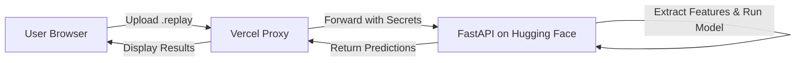

# 🚗🤖 Rocket League Bot Detector

A machine learning project designed to automatically detect whether players in a Rocket League `.replay` file are humans or bots. This project features a full-stack architecture, providing a seamless user interface and robust AI inference.

## 🌟 Overview

The system analyzes player behaviors from replay files and extracts key features (physical and network data) to classify each player with a confidence score.

The architecture is divided into three main components:
1. **Frontend (Vercel)**: A static, user-friendly interface where users can drag and drop `.replay` files.
2. **Serverless Proxy API (Vercel)**: A secure bridge that protects backend secrets, enforces rate limits, and validates upload sizes.
3. **AI Backend (Hugging Face Spaces - FastAPI)**: The core inference engine. It reads the replay, extracts features for each player, runs the PyTorch model, and returns predictions.

## 🏗️ Architecture

## 📂 Repository Structure

This repository highlights the core components of the project:

- **`/website_frontend`**: Contains the static web interface (`public/`) and the Vercel serverless function (`api/analyze.js`).
- **`/website`**: Contains the FastAPI backend and Hugging Face space configuration.
- **`src/`, `train.py`, `eval.py`, `dataset.py`**: The machine learning pipeline, including data preparation, model architecture, and training/evaluation scripts.
- **`analyzer_utils.py`, `eval_player_game.py`**: Utility scripts for parsing `.replay` files and extracting physical/network features.
- **`best.pt`**: The trained PyTorch model weights.

## 🚀 Deployment

### Frontend (Vercel)
Deployed via Vercel. Requires configuring `HF_API_URL` and `HF_API_KEY` in the environment variables to securely communicate with the backend.

### Backend (Hugging Face)
Deployed as a Docker Space on Hugging Face. Requires `HF_API_KEY` (to authenticate requests from Vercel) and `ALLOWED_ORIGIN` (for CORS).

## 🛡️ Security & Performance
- **No secrets in the browser**: The Vercel proxy securely injects the API keys.
- **Rate limiting**: Built-in protections against abuse.
- **Resource management**: The backend uses bounded concurrency and timeouts to ensure stability during heavy AI inference.